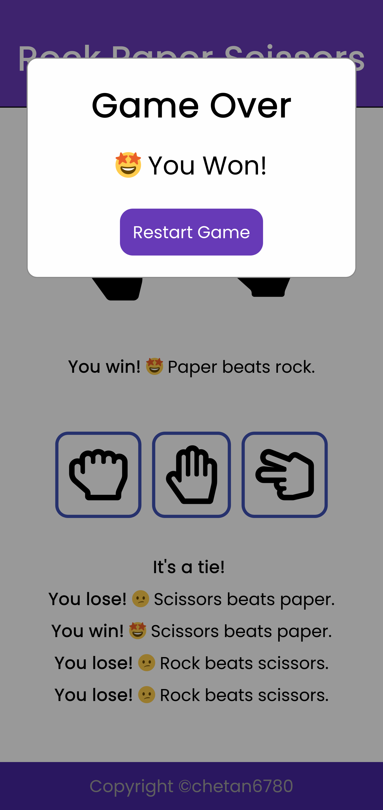

# Rock-Paper-Scissors

Rock paper scissors is a hand game, usually played between two people, in which each player simultaneously forms one of three shapes("rock", "paper", and "scissors") with an outstretched hand.

### Rules of the game

-   Whoever get **5 points** first, wins the game.
-   **Rock** beats **scissors**.
-   **Paper** beats **rock**.
-   **Scissors** beats **paper**.
-   Have **fun** playing! 😄🤟

        
        
        

favicon made by <a href="https://www.freepik.com" title="Freepik">Freepik</a> from <a href="https://www.flaticon.com/" title="Flaticon">www.flaticon.com</a>

Hand icons by [font awesome](https://fontawesome.com/start)
